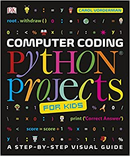

# Computer Coding - Python Projects



```
Flexibound: 224 pages 
Age Range: 9 - 12 years
Publisher: DK Children (1 Jun. 2017) 
Language: English 
ISBN-10: 0241286867 
ISBN-13: 978-0241286869
```

## Chapters

- Starting with Python
 
  - Wk-01 
- First Steps
- Turtle Graphics
- Playful Apps
- Games in Python
- Reference


